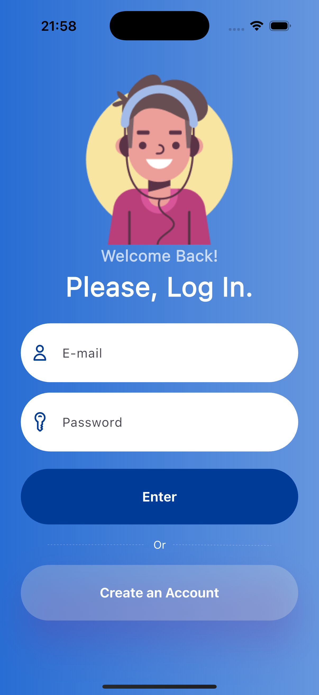

# Flutter Login Screen UI

A modern and customizable login screen UI project developed with Flutter. This project serves as a template for studies and can be implemented in applications that require an elegant authentication interface.



## ✨ Features

- **Modern UI:** Clean design with a focus on user experience.
- **Gradient Background:** A linear gradient background that can be easily changed.
- **Custom Fonts:** An example of how to import and use custom fonts in a Flutter project.
- **Styled Components:** Buttons with custom shadows and text fields with SVG icons.
- **Easy to Customize:** Colors, fonts, icons, and images are centralized in a single file (`lib/consts.dart`) for easy modification.
- **Responsive:** The layout adapts to different screen sizes.

## 🚀 Tech Stack

- **Flutter:** v3.29.2
- **Dart:** v3.7.2

## ⚙️ Getting Started

Follow the steps below to get the project running on your local machine.

### Prerequisites

- You must have the [Flutter SDK](https://flutter.dev/docs/get-started/install) installed on your machine.
- An Android/iOS emulator or a physical device connected.

### Installation

1.  **Clone the repository:**
    ```sh
    git clone https://github.com/juanndev/login_page_app.git
    ```

2.  **Navigate to the project directory:**
    ```sh
    cd YOUR-REPOSITORY-NAME
    ```

3.  **Install the dependencies:**
    ```sh
    flutter pub get
    ```

4.  **Run the app:**
    ```sh
    flutter run
    ```

## 🎨 Customization

The main advantage of this project is its ease of customization. All important constants are located in the `lib/consts.dart` file.

To change the app's appearance:

- **Colors:** Modify the `g1`, `g2`, `kInputColor`, etc., variables.
- **Icons & Images:** Change the paths in the `userIcon`, `keyIcon`, and `image1` variables.
- **Fonts:** To change the font, add the new `.ttf` file to the `fonts` folder and update the family name in `pubspec.yaml` and in the `ThemeData` in `main.dart`.

---

Made with ❤️ by [juanndev](https://github.com/juanndev)